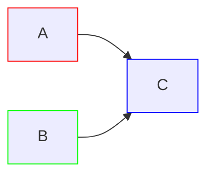

## This is a markdown test file.

This is a markdown test file.

It contains a mermaid example

```mermaid
flowchart LR;
    A:::foo & B:::bar --> C:::foobar;
    classDef foo stroke:#f00;
    classDef bar stroke:#0f0;
    classDef foobar stroke:#00f;
```

Here is a simple flow chart:

```mermaid
graph TD;
    A-->B;
    A-->C;
    B-->D;
    C-->D;
```

