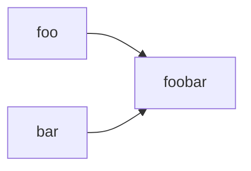

## This is a markdown test file.

This is a markdown test file.

It contains a mermaid example



Here is a simple flow chart:


Some GeoJSON :
```geojson
{
  "type": "FeatureCollection",
  "features": [
    {
      "type": "Feature",
      "id": 1,
      "properties": {
        "ID": 0
      },
      "geometry": {
        "type": "Polygon",
        "coordinates":
          [
            [
              [4.48736,51.91470],
              [4.48729,51.91474],
              [4.48721,51.91479],
              [4.48708,51.91486],
              [4.48668,51.91459],
              [4.48649,51.91446],
              [4.48660,51.91440],
              [4.48675,51.91431],
              [4.48677,51.91430],
              [4.48736,51.91470]
            ]
        ]
      }
    }
  ]
}
```

There is also TopoJSON:
```topojson
{
  "type": "Topology",
  "transform": {
    "scale": [1.0, 1.0],
    "translate": [0, 0]
  },
  "objects": {
    "example": {
      "type": "GeometryCollection",
      "geometries": [
        {
          "type": "Point",
          "properties": {"prop0": "value0"},
          "coordinates": [4.88702 , 52.40379]
        },
        {
          "type": "Point",
          "properties": {"prop0": "value0"},
          "coordinates": [4.88661 , 52.40362]
        }
]
}
}
}
```

And STL:
```stl
solid cube_corner
  facet normal 0.0 -1.0 0.0
    outer loop
      vertex 0.0 0.0 0.0
      vertex 1.0 0.0 0.0
      vertex 0.0 0.0 1.0
    endloop
  endfacet
  facet normal 0.0 0.0 -1.0
    outer loop
      vertex 0.0 0.0 0.0
      vertex 0.0 1.0 0.0
      vertex 1.0 0.0 0.0
    endloop
  endfacet
  facet normal -1.0 0.0 0.0
    outer loop
      vertex 0.0 0.0 0.0
      vertex 0.0 0.0 1.0
      vertex 0.0 1.0 0.0
    endloop
  endfacet
  facet normal 0.577 0.577 0.577
    outer loop
      vertex 1.0 0.0 0.0
      vertex 0.0 1.0 0.0
      vertex 0.0 0.0 1.0
    endloop
  endfacet
endsolid
```
