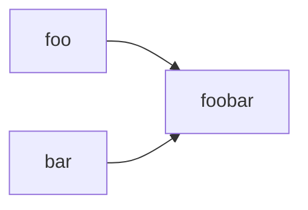

## This is a markdown test file.

This is a markdown test file.

It contains a mermaid example


Here is a simple flow chart:


Some GeoJSON :
```geojson
{
  "type": "FeatureCollection",
  "features": [
    {
      "type": "Feature",
      "id": 1,
      "properties": {
        "ID": 0
      },
      "geometry": {
        "type": "Polygon",
        "coordinates":
          [
            [
              [4.48736,51.91470],
              [4.48729,51.91474],
              [4.48721,51.91479],
              [4.48708,51.91486],
              [4.48668,51.91459],
              [4.48649,51.91446],
              [4.48660,51.91440],
              [4.48675,51.91431],
              [4.48677,51.91430],
              [4.48736,51.91470]
            ]
        ]
      }
    }
  ]
}
```

There is also TopoJSON:
```topojson
{
  "type": "Topology",
  "objects": {
    "example": {
      "type": "GeometryCollection",
      "geometries": [
        {
          "type": "Polygon",
          "properties": {"prop0": "value0",
            "prop1": {"this": "that"}
          },
          "arcs": [[0]]
        }
      ]
    }
  },
  "arcs": [[[4.88702 , 52.40379],[4.88689 , 52.40384],[4.88661 , 52.40362],[4.88673 , 52.40356],[4.88702 , 52.40379]]]
}
```

And STL:
```stl
solid 3D282368213074
facet normal -3.032402e-01 2.875028e-01 9.085084e-01
    outer loop
        vertex -2.446522e+01 -3.277491e+01 2.990000e+01
        vertex -2.058089e+01 -3.641995e+01 3.235000e+01
        vertex 1.027444e+01 1.275130e+00 3.072000e+01
    endloop
endfacet
facet normal -3.110866e-01 2.937243e-01 9.038535e-01
    outer loop
        vertex -2.058089e+01 -3.641995e+01 3.235000e+01
        vertex 1.270189e+01 -1.169797e+00 3.235000e+01
        vertex 1.027444e+01 1.275130e+00 3.072000e+01
    endloop
endfacet
facet normal 3.038313e-01 -2.868738e-01 9.085097e-01
    outer loop
        vertex 1.270189e+01 -1.169797e+00 3.235000e+01
        vertex -2.058089e+01 -3.641995e+01 3.235000e+01
        vertex -1.669656e+01 -4.006500e+01 2.990000e+01
    endloop
endfacet
facet normal -3.102046e-01 2.947209e-01 9.038322e-01
    outer loop
        vertex -2.446522e+01 -3.277491e+01 2.990000e+01
        vertex 1.027444e+01 1.275130e+00 3.072000e+01
        vertex 9.428011e+00 2.070942e+00 3.017000e+01
    endloop
endfacet
facet normal -2.928177e-01 2.777232e-01 9.149468e-01
    outer loop
        vertex 9.428011e+00 2.070942e+00 3.017000e+01
        vertex 9.479289e+00 2.487397e+00 3.006000e+01
        vertex -2.446522e+01 -3.277491e+01 2.990000e+01
    endloop
endfacet
facet normal -3.430140e-01 3.224777e-01 8.822412e-01
    outer loop
        vertex 1.027342e+01 3.294641e+00 3.006000e+01
        vertex 1.057251e+01 3.311834e+00 3.017000e+01
        vertex 1.565344e+01 9.455000e+00 2.990000e+01
    endloop
endfacet
facet normal -2.233435e-01 2.197170e-01 9.496537e-01
    outer loop
        vertex 9.479289e+00 2.487397e+00 3.006000e+01
        vertex 1.027342e+01 3.294641e+00 3.006000e+01
        vertex 1.565344e+01 9.455000e+00 2.990000e+01
    endloop
endfacet
facet normal -3.220476e-01 3.059471e-01 8.959251e-01
    outer loop
        vertex -2.446522e+01 -3.277491e+01 2.990000e+01
        vertex 9.479289e+00 2.487397e+00 3.006000e+01
        vertex 1.565344e+01 9.455000e+00 2.990000e+01
    endloop
endfacet
facet normal -3.216821e-01 2.882271e-01 9.019123e-01
    outer loop
        vertex 1.143027e+01 2.222852e+00 3.080000e+01
        vertex 1.059489e+01 1.290505e+00 3.080000e+01
        vertex 1.337524e+01 -4.566398e-01 3.235000e+01
    endloop
endfacet
facet normal -3.152838e-01 2.976872e-01 9.010985e-01
    outer loop
        vertex 1.270189e+01 -1.169797e+00 3.235000e+01
        vertex 1.337524e+01 -4.566398e-01 3.235000e+01
        vertex 1.059489e+01 1.290505e+00 3.080000e+01
    endloop
endfacet
facet normal 3.124541e-01 -2.950154e-01 9.029609e-01
    outer loop
        vertex 1.337524e+01 -4.566398e-01 3.235000e+01
        vertex 1.270189e+01 -1.169797e+00 3.235000e+01
        vertex 2.311819e+01 2.363446e+00 2.990000e+01
    endloop
endfacet
facet normal -2.421892e-01 3.601625e-01 9.009036e-01
    outer loop
        vertex 1.059489e+01 1.290505e+00 3.080000e+01
        vertex 1.027444e+01 1.275130e+00 3.072000e+01
        vertex 1.270189e+01 -1.169797e+00 3.235000e+01
    endloop
endfacet
facet normal -4.840195e-01 1.476030e-01 8.625187e-01
    outer loop
        vertex 1.143027e+01 2.222852e+00 3.080000e+01
        vertex 1.337524e+01 -4.566398e-01 3.235000e+01
        vertex 1.138552e+01 2.543579e+00 3.072000e+01
    endloop
endfacet
facet normal -3.198393e-01 3.039759e-01 8.973859e-01
    outer loop
        vertex 1.565344e+01 9.455000e+00 2.990000e+01
        vertex 1.057251e+01 3.311834e+00 3.017000e+01
        vertex 1.138552e+01 2.543579e+00 3.072000e+01
    endloop
endfacet
facet normal -3.094224e-01 2.982042e-01 9.029574e-01
    outer loop
        vertex 1.565344e+01 9.455000e+00 2.990000e+01
        vertex 1.138552e+01 2.543579e+00 3.072000e+01
        vertex 1.938581e+01 5.909223e+00 3.235000e+01
    endloop
endfacet
facet normal -3.065018e-01 2.893953e-01 9.068115e-01
    outer loop
        vertex 1.938581e+01 5.909223e+00 3.235000e+01
        vertex 1.138552e+01 2.543579e+00 3.072000e+01
        vertex 1.337524e+01 -4.566398e-01 3.235000e+01
    endloop
endfacet
facet normal 3.124541e-01 -2.950154e-01 9.029609e-01
    outer loop
        vertex 1.337524e+01 -4.566398e-01 3.235000e+01
        vertex 2.311819e+01 2.363446e+00 2.990000e+01
        vertex 1.938581e+01 5.909223e+00 3.235000e+01
    endloop
endfacet
facet normal 3.118847e-01 -2.926718e-01 9.039199e-01
    outer loop
        vertex 1.270189e+01 -1.169797e+00 3.235000e+01
        vertex -1.669656e+01 -4.006500e+01 2.990000e+01
        vertex 2.311819e+01 2.363446e+00 2.990000e+01
    endloop
endfacet
facet normal 0.000000e+00 0.000000e+00 1.000000e+00
    outer loop
        vertex -1.669656e+01 -4.006500e+01 2.717000e+01
        vertex -2.345656e+01 -3.534500e+01 2.717000e+01
        vertex -1.297456e+01 -4.515800e+01 2.717000e+01
    endloop
endfacet
facet normal 0.000000e+00 0.000000e+00 1.000000e+00
    outer loop
        vertex -2.345656e+01 -3.534500e+01 2.717000e+01
        vertex -1.669656e+01 -4.006500e+01 2.717000e+01
        vertex -2.058089e+01 -3.641995e+01 2.717000e+01
    endloop
endfacet
facet normal 0.000000e+00 0.000000e+00 1.000000e+00
    outer loop
        vertex 2.953344e+01 -2.585000e+00 2.717000e+01
        vertex -1.669656e+01 -4.006500e+01 2.717000e+01
        vertex -1.148556e+01 -4.655200e+01 2.717000e+01
    endloop
endfacet
facet normal 0.000000e+00 0.000000e+00 1.000000e+00
    outer loop
        vertex -3.081656e+01 -2.845500e+01 2.717000e+01
        vertex -2.446522e+01 -3.277491e+01 2.717000e+01
        vertex -1.780156e+01 -1.450000e+01 2.717000e+01
    endloop
endfacet
facet normal 0.000000e+00 0.000000e+00 1.000000e+00
    outer loop
        vertex -2.446522e+01 -3.277491e+01 2.717000e+01
        vertex -3.081656e+01 -2.845500e+01 2.717000e+01
        vertex -2.345656e+01 -3.534500e+01 2.717000e+01
    endloop
endfacet
facet normal 0.000000e+00 0.000000e+00 1.000000e+00
    outer loop
        vertex -2.058089e+01 -3.641995e+01 2.717000e+01
        vertex -2.446522e+01 -3.277491e+01 2.717000e+01
        vertex -2.345656e+01 -3.534500e+01 2.717000e+01
    endloop
endfacet
facet normal 0.000000e+00 0.000000e+00 1.000000e+00
    outer loop
        vertex 2.953344e+01 -2.585000e+00 2.717000e+01
        vertex 2.311819e+01 2.363446e+00 2.717000e+01
        vertex -1.669656e+01 -4.006500e+01 2.717000e+01
    endloop
endfacet
facet normal 0.000000e+00 0.000000e+00 1.000000e+00
    outer loop
        vertex -1.669656e+01 -4.006500e+01 2.717000e+01
        vertex -1.297456e+01 -4.515800e+01 2.717000e+01
        vertex -1.148556e+01 -4.655200e+01 2.717000e+01
    endloop
endfacet
facet normal 0.000000e+00 0.000000e+00 1.000000e+00
    outer loop
        vertex 2.953344e+01 -2.585000e+00 2.717000e+01
        vertex 2.470844e+01 1.911000e+00 2.717000e+01
        vertex 2.311819e+01 2.363446e+00 2.717000e+01
    endloop
endfacet
facet normal 0.000000e+00 0.000000e+00 1.000000e+00
    outer loop
        vertex 2.311819e+01 2.363446e+00 2.717000e+01
        vertex 2.470844e+01 1.911000e+00 2.717000e+01
        vertex 1.906044e+01 7.174000e+00 2.717000e+01
    endloop
endfacet
facet normal 0.000000e+00 0.000000e+00 1.000000e+00
    outer loop
        vertex 1.015344e+01 1.547500e+01 2.717000e+01
        vertex 1.565344e+01 9.455000e+00 2.717000e+01
        vertex 1.906044e+01 7.174000e+00 2.717000e+01
    endloop
endfacet
facet normal 0.000000e+00 0.000000e+00 1.000000e+00
    outer loop
        vertex 1.015344e+01 1.547500e+01 2.717000e+01
        vertex -1.780156e+01 -1.450000e+01 2.717000e+01
        vertex 1.565344e+01 9.455000e+00 2.717000e+01
    endloop
endfacet
facet normal 0.000000e+00 0.000000e+00 1.000000e+00
    outer loop
        vertex 1.906044e+01 7.174000e+00 2.717000e+01
        vertex 1.938581e+01 5.909223e+00 2.717000e+01
        vertex 2.311819e+01 2.363446e+00 2.717000e+01
    endloop
endfacet
facet normal 0.000000e+00 0.000000e+00 1.000000e+00
    outer loop
        vertex 1.938581e+01 5.909223e+00 2.717000e+01
        vertex 1.906044e+01 7.174000e+00 2.717000e+01
        vertex 1.565344e+01 9.455000e+00 2.717000e+01
    endloop
endfacet
facet normal 0.000000e+00 0.000000e+00 1.000000e+00
    outer loop
        vertex -2.446522e+01 -3.277491e+01 2.717000e+01
        vertex 1.565344e+01 9.455000e+00 2.717000e+01
        vertex -1.780156e+01 -1.450000e+01 2.717000e+01
    endloop
endfacet
facet normal 0.000000e+00 0.000000e+00 1.000000e+00
    outer loop
        vertex 9.428011e+00 2.070942e+00 3.382000e+01
        vertex 1.027444e+01 1.275130e+00 3.382000e+01
        vertex 9.479289e+00 2.487397e+00 3.382000e+01
    endloop
endfacet
facet normal 0.000000e+00 0.000000e+00 1.000000e+00
    outer loop
        vertex 1.138552e+01 2.543579e+00 3.382000e+01
        vertex 1.027342e+01 3.294641e+00 3.382000e+01
        vertex 9.479289e+00 2.487397e+00 3.382000e+01
    endloop
endfacet
facet normal 0.000000e+00 0.000000e+00 1.000000e+00
    outer loop
        vertex 9.479289e+00 2.487397e+00 3.382000e+01
        vertex 1.027444e+01 1.275130e+00 3.382000e+01
        vertex 1.059489e+01 1.290505e+00 3.382000e+01
    endloop
endfacet
facet normal 0.000000e+00 0.000000e+00 1.000000e+00
    outer loop
        vertex 1.059489e+01 1.290505e+00 3.382000e+01
        vertex 1.143027e+01 2.222852e+00 3.382000e+01
        vertex 1.138552e+01 2.543579e+00 3.382000e+01
    endloop
endfacet
facet normal 0.000000e+00 0.000000e+00 1.000000e+00
    outer loop
        vertex 1.057251e+01 3.311834e+00 3.382000e+01
        vertex 1.027342e+01 3.294641e+00 3.382000e+01
        vertex 1.138552e+01 2.543579e+00 3.382000e+01
    endloop
endfacet
facet normal 0.000000e+00 0.000000e+00 1.000000e+00
    outer loop
        vertex 1.138552e+01 2.543579e+00 3.382000e+01
        vertex 9.479289e+00 2.487397e+00 3.382000e+01
        vertex 1.059489e+01 1.290505e+00 3.382000e+01
    endloop
endfacet
facet normal 0.000000e+00 0.000000e+00 -1.000000e+00
    outer loop
        vertex -2.345656e+01 -3.534500e+01 5.340000e+00
        vertex -1.780156e+01 -1.450000e+01 5.340000e+00
        vertex -1.297456e+01 -4.515800e+01 5.340000e+00
    endloop
endfacet
facet normal 0.000000e+00 0.000000e+00 -1.000000e+00
    outer loop
        vertex -1.780156e+01 -1.450000e+01 5.340000e+00
        vertex -2.345656e+01 -3.534500e+01 5.340000e+00
        vertex -3.081656e+01 -2.845500e+01 5.340000e+00
    endloop
endfacet
facet normal 0.000000e+00 0.000000e+00 -1.000000e+00
    outer loop
        vertex -1.297456e+01 -4.515800e+01 5.340000e+00
        vertex -1.780156e+01 -1.450000e+01 5.340000e+00
        vertex -1.148556e+01 -4.655200e+01 5.340000e+00
    endloop
endfacet
facet normal 0.000000e+00 0.000000e+00 -1.000000e+00
    outer loop
        vertex 2.953344e+01 -2.585000e+00 5.340000e+00
        vertex -1.780156e+01 -1.450000e+01 5.340000e+00
        vertex 2.470844e+01 1.911000e+00 5.340000e+00
    endloop
endfacet
facet normal 0.000000e+00 0.000000e+00 -1.000000e+00
    outer loop
        vertex 1.015344e+01 1.547500e+01 5.340000e+00
        vertex 1.906044e+01 7.174000e+00 5.340000e+00
        vertex -1.780156e+01 -1.450000e+01 5.340000e+00
    endloop
endfacet
facet normal 0.000000e+00 0.000000e+00 -1.000000e+00
    outer loop
        vertex 1.906044e+01 7.174000e+00 5.340000e+00
        vertex 2.470844e+01 1.911000e+00 5.340000e+00
        vertex -1.780156e+01 -1.450000e+01 5.340000e+00
    endloop
endfacet
facet normal 0.000000e+00 0.000000e+00 -1.000000e+00
    outer loop
        vertex -1.148556e+01 -4.655200e+01 5.340000e+00
        vertex -1.780156e+01 -1.450000e+01 5.340000e+00
        vertex 2.953344e+01 -2.585000e+00 5.340000e+00
    endloop
endfacet
facet normal 7.292106e-01 -6.842894e-01 0.000000e+00
    outer loop
        vertex -1.669656e+01 -4.006500e+01 2.717000e+01
        vertex 2.311819e+01 2.363446e+00 2.717000e+01
        vertex 2.311819e+01 2.363446e+00 2.990000e+01
    endloop
endfacet
facet normal 7.292106e-01 -6.842894e-01 0.000000e+00
    outer loop
        vertex -1.669656e+01 -4.006500e+01 2.717000e+01
        vertex 2.311819e+01 2.363446e+00 2.990000e+01
        vertex -1.669656e+01 -4.006500e+01 2.990000e+01
    endloop
endfacet
facet normal 6.887517e-01 7.249973e-01 0.000000e+00
    outer loop
        vertex 2.311819e+01 2.363446e+00 2.717000e+01
        vertex 1.938581e+01 5.909223e+00 2.717000e+01
        vertex 1.938581e+01 5.909223e+00 3.235000e+01
    endloop
endfacet
facet normal 6.887517e-01 7.249973e-01 0.000000e+00
    outer loop
        vertex 2.311819e+01 2.363446e+00 2.717000e+01
        vertex 1.938581e+01 5.909223e+00 3.235000e+01
        vertex 2.311819e+01 2.363446e+00 2.990000e+01
    endloop
endfacet
facet normal 6.887517e-01 7.249973e-01 0.000000e+00
    outer loop
        vertex 1.938581e+01 5.909223e+00 2.717000e+01
        vertex 1.565344e+01 9.455000e+00 2.717000e+01
        vertex 1.565344e+01 9.455000e+00 2.990000e+01
    endloop
endfacet
facet normal 6.887517e-01 7.249973e-01 0.000000e+00
    outer loop
        vertex 1.938581e+01 5.909223e+00 2.717000e+01
        vertex 1.565344e+01 9.455000e+00 2.990000e+01
        vertex 1.938581e+01 5.909223e+00 3.235000e+01
    endloop
endfacet
facet normal -7.249973e-01 6.887517e-01 0.000000e+00
    outer loop
        vertex 1.565344e+01 9.455000e+00 2.717000e+01
        vertex -2.446522e+01 -3.277491e+01 2.717000e+01
        vertex -2.446522e+01 -3.277491e+01 2.990000e+01
    endloop
endfacet
facet normal -7.249973e-01 6.887517e-01 0.000000e+00
    outer loop
        vertex 1.565344e+01 9.455000e+00 2.717000e+01
        vertex -2.446522e+01 -3.277491e+01 2.990000e+01
        vertex 1.565344e+01 9.455000e+00 2.990000e+01
    endloop
endfacet
facet normal -6.842894e-01 -7.292106e-01 0.000000e+00
    outer loop
        vertex -2.446522e+01 -3.277491e+01 2.717000e+01
        vertex -2.058089e+01 -3.641995e+01 2.717000e+01
        vertex -2.058089e+01 -3.641995e+01 3.235000e+01
    endloop
endfacet
facet normal -6.842894e-01 -7.292106e-01 0.000000e+00
    outer loop
        vertex -2.446522e+01 -3.277491e+01 2.717000e+01
        vertex -2.058089e+01 -3.641995e+01 3.235000e+01
        vertex -2.446522e+01 -3.277491e+01 2.990000e+01
    endloop
endfacet
facet normal -6.842894e-01 -7.292106e-01 0.000000e+00
    outer loop
        vertex -2.058089e+01 -3.641995e+01 2.717000e+01
        vertex -1.669656e+01 -4.006500e+01 2.717000e+01
        vertex -1.669656e+01 -4.006500e+01 2.990000e+01
    endloop
endfacet
facet normal -6.842894e-01 -7.292106e-01 0.000000e+00
    outer loop
        vertex -2.058089e+01 -3.641995e+01 2.717000e+01
        vertex -1.669656e+01 -4.006500e+01 2.990000e+01
        vertex -2.058089e+01 -3.641995e+01 3.235000e+01
    endloop
endfacet
facet normal 6.817238e-01 7.316097e-01 0.000000e+00
    outer loop
        vertex 2.953344e+01 -2.585000e+00 5.340000e+00
        vertex 2.470844e+01 1.911000e+00 5.340000e+00
        vertex 2.470844e+01 1.911000e+00 2.717000e+01
    endloop
endfacet
facet normal 6.817238e-01 7.316097e-01 0.000000e+00
    outer loop
        vertex 2.953344e+01 -2.585000e+00 5.340000e+00
        vertex 2.470844e+01 1.911000e+00 2.717000e+01
        vertex 2.953344e+01 -2.585000e+00 2.717000e+01
    endloop
endfacet
facet normal 6.817319e-01 7.316021e-01 0.000000e+00
    outer loop
        vertex 2.470844e+01 1.911000e+00 5.340000e+00
        vertex 1.906044e+01 7.174000e+00 5.340000e+00
        vertex 1.906044e+01 7.174000e+00 2.717000e+01
    endloop
endfacet
facet normal 6.817319e-01 7.316021e-01 0.000000e+00
    outer loop
        vertex 2.470844e+01 1.911000e+00 5.340000e+00
        vertex 1.906044e+01 7.174000e+00 2.717000e+01
        vertex 2.470844e+01 1.911000e+00 2.717000e+01
    endloop
endfacet
facet normal 6.817825e-01 7.315549e-01 0.000000e+00
    outer loop
        vertex 1.906044e+01 7.174000e+00 5.340000e+00
        vertex 1.015344e+01 1.547500e+01 5.340000e+00
        vertex 1.015344e+01 1.547500e+01 2.717000e+01
    endloop
endfacet
facet normal 6.817825e-01 7.315549e-01 0.000000e+00
    outer loop
        vertex 1.906044e+01 7.174000e+00 5.340000e+00
        vertex 1.015344e+01 1.547500e+01 2.717000e+01
        vertex 1.906044e+01 7.174000e+00 2.717000e+01
    endloop
endfacet
facet normal -7.313189e-01 6.820357e-01 0.000000e+00
    outer loop
        vertex 1.015344e+01 1.547500e+01 5.340000e+00
        vertex -1.780156e+01 -1.450000e+01 5.340000e+00
        vertex -1.780156e+01 -1.450000e+01 2.717000e+01
    endloop
endfacet
facet normal -7.313189e-01 6.820357e-01 0.000000e+00
    outer loop
        vertex 1.015344e+01 1.547500e+01 5.340000e+00
        vertex -1.780156e+01 -1.450000e+01 2.717000e+01
        vertex 1.015344e+01 1.547500e+01 2.717000e+01
    endloop
endfacet
facet normal -7.313079e-01 6.820475e-01 0.000000e+00
    outer loop
        vertex -1.780156e+01 -1.450000e+01 5.340000e+00
        vertex -3.081656e+01 -2.845500e+01 5.340000e+00
        vertex -3.081656e+01 -2.845500e+01 2.717000e+01
    endloop
endfacet
facet normal -7.313079e-01 6.820475e-01 0.000000e+00
    outer loop
        vertex -1.780156e+01 -1.450000e+01 5.340000e+00
        vertex -3.081656e+01 -2.845500e+01 2.717000e+01
        vertex -1.780156e+01 -1.450000e+01 2.717000e+01
    endloop
endfacet
facet normal -6.834130e-01 -7.300319e-01 0.000000e+00
    outer loop
        vertex -3.081656e+01 -2.845500e+01 5.340000e+00
        vertex -2.345656e+01 -3.534500e+01 5.340000e+00
        vertex -2.345656e+01 -3.534500e+01 2.717000e+01
    endloop
endfacet
facet normal -6.834130e-01 -7.300319e-01 0.000000e+00
    outer loop
        vertex -3.081656e+01 -2.845500e+01 5.340000e+00
        vertex -2.345656e+01 -3.534500e+01 2.717000e+01
        vertex -3.081656e+01 -2.845500e+01 2.717000e+01
    endloop
endfacet
facet normal -6.834267e-01 -7.300192e-01 0.000000e+00
    outer loop
        vertex -2.345656e+01 -3.534500e+01 5.340000e+00
        vertex -1.297456e+01 -4.515800e+01 5.340000e+00
        vertex -1.297456e+01 -4.515800e+01 2.717000e+01
    endloop
endfacet
facet normal -6.834267e-01 -7.300192e-01 0.000000e+00
    outer loop
        vertex -2.345656e+01 -3.534500e+01 5.340000e+00
        vertex -1.297456e+01 -4.515800e+01 2.717000e+01
        vertex -2.345656e+01 -3.534500e+01 2.717000e+01
    endloop
endfacet
facet normal -6.834354e-01 -7.300110e-01 0.000000e+00
    outer loop
        vertex -1.297456e+01 -4.515800e+01 5.340000e+00
        vertex -1.148556e+01 -4.655200e+01 5.340000e+00
        vertex -1.148556e+01 -4.655200e+01 2.717000e+01
    endloop
endfacet
facet normal -6.834354e-01 -7.300110e-01 0.000000e+00
    outer loop
        vertex -1.297456e+01 -4.515800e+01 5.340000e+00
        vertex -1.148556e+01 -4.655200e+01 2.717000e+01
        vertex -1.297456e+01 -4.515800e+01 2.717000e+01
    endloop
endfacet
facet normal 7.311952e-01 -6.821683e-01 0.000000e+00
    outer loop
        vertex -1.148556e+01 -4.655200e+01 5.340000e+00
        vertex 2.953344e+01 -2.585000e+00 5.340000e+00
        vertex 2.953344e+01 -2.585000e+00 2.717000e+01
    endloop
endfacet
facet normal 7.311952e-01 -6.821683e-01 0.000000e+00
    outer loop
        vertex -1.148556e+01 -4.655200e+01 5.340000e+00
        vertex 2.953344e+01 -2.585000e+00 2.717000e+01
        vertex -1.148556e+01 -4.655200e+01 2.717000e+01
    endloop
endfacet
facet normal -5.738934e-02 9.983519e-01 0.000000e+00
    outer loop
        vertex 1.057251e+01 3.311834e+00 3.017000e+01
        vertex 1.027342e+01 3.294641e+00 3.006000e+01
        vertex 1.027342e+01 3.294641e+00 3.382000e+01
    endloop
endfacet
facet normal -5.738934e-02 9.983519e-01 0.000000e+00
    outer loop
        vertex 1.057251e+01 3.311834e+00 3.017000e+01
        vertex 1.027342e+01 3.294641e+00 3.382000e+01
        vertex 1.057251e+01 3.311834e+00 3.382000e+01
    endloop
endfacet
facet normal -7.128707e-01 7.012955e-01 0.000000e+00
    outer loop
        vertex 1.027342e+01 3.294641e+00 3.006000e+01
        vertex 9.479289e+00 2.487397e+00 3.006000e+01
        vertex 9.479289e+00 2.487397e+00 3.382000e+01
    endloop
endfacet
facet normal -7.128707e-01 7.012955e-01 0.000000e+00
    outer loop
        vertex 1.027342e+01 3.294641e+00 3.006000e+01
        vertex 9.479289e+00 2.487397e+00 3.382000e+01
        vertex 1.027342e+01 3.294641e+00 3.382000e+01
    endloop
endfacet
facet normal -9.925047e-01 1.222064e-01 0.000000e+00
    outer loop
        vertex 9.479289e+00 2.487397e+00 3.006000e+01
        vertex 9.428011e+00 2.070942e+00 3.017000e+01
        vertex 9.428011e+00 2.070942e+00 3.382000e+01
    endloop
endfacet
facet normal -9.925047e-01 1.222064e-01 0.000000e+00
    outer loop
        vertex 9.479289e+00 2.487397e+00 3.006000e+01
        vertex 9.428011e+00 2.070942e+00 3.382000e+01
        vertex 9.479289e+00 2.487397e+00 3.382000e+01
    endloop
endfacet
facet normal -6.849883e-01 -7.285540e-01 0.000000e+00
    outer loop
        vertex 9.428011e+00 2.070942e+00 3.017000e+01
        vertex 1.027444e+01 1.275130e+00 3.072000e+01
        vertex 1.027444e+01 1.275130e+00 3.382000e+01
    endloop
endfacet
facet normal -6.849883e-01 -7.285540e-01 0.000000e+00
    outer loop
        vertex 9.428011e+00 2.070942e+00 3.017000e+01
        vertex 1.027444e+01 1.275130e+00 3.382000e+01
        vertex 9.428011e+00 2.070942e+00 3.382000e+01
    endloop
endfacet
facet normal 4.792293e-02 -9.988510e-01 0.000000e+00
    outer loop
        vertex 1.027444e+01 1.275130e+00 3.072000e+01
        vertex 1.059489e+01 1.290505e+00 3.080000e+01
        vertex 1.059489e+01 1.290505e+00 3.382000e+01
    endloop
endfacet
facet normal 4.792293e-02 -9.988510e-01 0.000000e+00
    outer loop
        vertex 1.027444e+01 1.275130e+00 3.072000e+01
        vertex 1.059489e+01 1.290505e+00 3.382000e+01
        vertex 1.027444e+01 1.275130e+00 3.382000e+01
    endloop
endfacet
facet normal 7.447736e-01 -6.673172e-01 0.000000e+00
    outer loop
        vertex 1.059489e+01 1.290505e+00 3.080000e+01
        vertex 1.143027e+01 2.222852e+00 3.080000e+01
        vertex 1.143027e+01 2.222852e+00 3.382000e+01
    endloop
endfacet
facet normal 7.447736e-01 -6.673172e-01 0.000000e+00
    outer loop
        vertex 1.059489e+01 1.290505e+00 3.080000e+01
        vertex 1.143027e+01 2.222852e+00 3.382000e+01
        vertex 1.059489e+01 1.290505e+00 3.382000e+01
    endloop
endfacet
facet normal 9.904049e-01 1.381960e-01 0.000000e+00
    outer loop
        vertex 1.143027e+01 2.222852e+00 3.080000e+01
        vertex 1.138552e+01 2.543579e+00 3.072000e+01
        vertex 1.138552e+01 2.543579e+00 3.382000e+01
    endloop
endfacet
facet normal 9.904049e-01 1.381960e-01 0.000000e+00
    outer loop
        vertex 1.143027e+01 2.222852e+00 3.080000e+01
        vertex 1.138552e+01 2.543579e+00 3.382000e+01
        vertex 1.143027e+01 2.222852e+00 3.382000e+01
    endloop
endfacet
facet normal 6.868193e-01 7.268282e-01 0.000000e+00
    outer loop
        vertex 1.138552e+01 2.543579e+00 3.072000e+01
        vertex 1.057251e+01 3.311834e+00 3.017000e+01
        vertex 1.057251e+01 3.311834e+00 3.382000e+01
    endloop
endfacet
facet normal 6.868193e-01 7.268282e-01 0.000000e+00
    outer loop
        vertex 1.138552e+01 2.543579e+00 3.072000e+01
        vertex 1.057251e+01 3.311834e+00 3.382000e+01
        vertex 1.138552e+01 2.543579e+00 3.382000e+01
    endloop
endfacet
endsolid 3D282368213074
```
